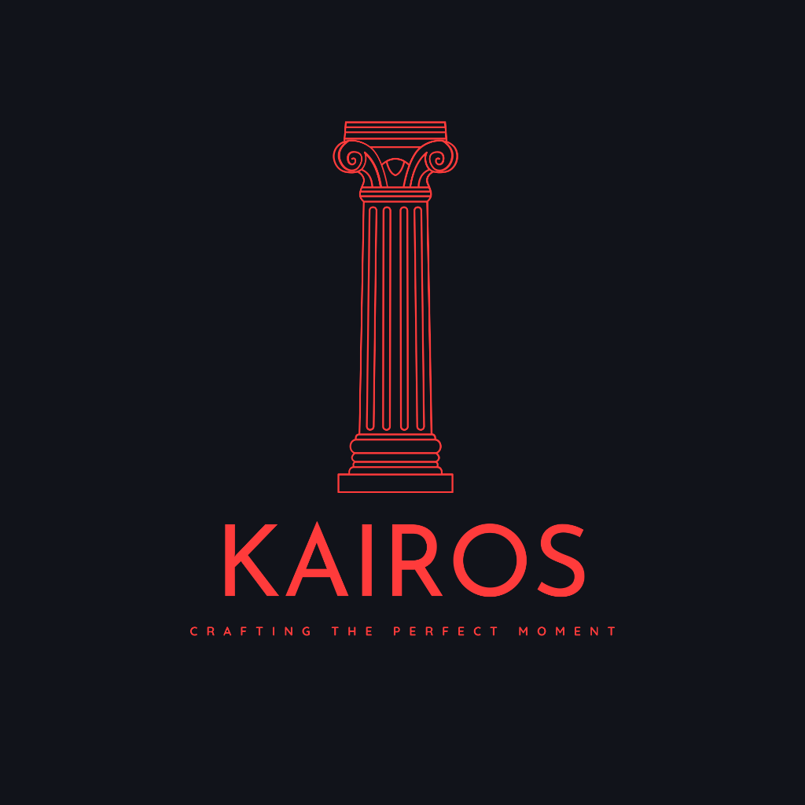

# KAIROS - AI-Powered Event Planning System

<div align="center">



**A sophisticated event planning platform powered by AI**

[](https://nodejs.org/)
[](https://reactjs.org/)
[](https://www.mongodb.com/)
[](LICENSE)

[Features](#-features) • [Quick Start](#-quick-start) • [Documentation](#-documentation) • [Demo](#-demo) • [Contributing](#-contributing)

</div>

---

## 📖 Overview

KAIROS is an intelligent event planning platform that revolutionizes how users plan weddings, corporate events, birthdays, and celebrations. By leveraging AI-powered recommendations, users receive personalized venue, catering, and decoration suggestions tailored to their budget, guest count, and preferences.

### Why KAIROS?

- 🤖 **AI-Powered Recommendations** - Smart matching using Groq's LLaMA models
- 🎯 **Personalized Planning** - Tailored suggestions based on your requirements
- 💰 **Budget Optimization** - Intelligent budget allocation and cost management
- 📊 **Real-time Availability** - Live venue and vendor availability checking
- 🔒 **Secure Booking** - JWT-based authentication and secure transactions
- 📱 **Modern UI/UX** - Sleek, responsive design with glassmorphism aesthetics

## 🛠️ Tech Stack

### Backend
- **Runtime**: Node.js 18+
- **Framework**: Express.js
- **Database**: MongoDB (Mongoose ODM)
- **Authentication**: JWT (JSON Web Tokens)
- **AI Engine**: Groq API (LLaMA 3.3 70B)
- **Caching**: Redis (optional)
- **Validation**: Joi & Zod

### Frontend
- **Framework**: React 19
- **Build Tool**: Vite 8
- **Styling**: TailwindCSS 3.4
- **Routing**: React Router v7
- **UI Components**: Custom components with shadcn/ui patterns
- **Icons**: Material Symbols
- **State Management**: React Context API

## ✨ Features

### 👤 Customer Features

#### 🎨 AI Event Planner
- **Intelligent Planning**: AI generates comprehensive event plans with budget allocation
- **Timeline Generation**: Automated planning timeline with key milestones
- **Style Recommendations**: Personalized suggestions based on event vibe and theme
- **Budget Breakdown**: Smart allocation across venue, catering, and decoration

#### 🔍 Smart Recommendations
- **AI-Powered Matching**: Advanced recommendation engine using Groq LLaMA models
- **Multi-Factor Scoring**: Considers budget, capacity, ratings, and preferences
- **Reasoning Transparency**: See why each vendor was recommended
- **Comparison Tools**: Side-by-side vendor comparison
- **Filtering & Sorting**: Refine results by price, rating, and availability

#### 📅 Booking Management
- **Real-time Availability**: Live venue availability checking
- **Instant Booking**: Seamless booking confirmation
- **Booking References**: Human-readable codes (e.g., `KRS-A7X3`)
- **Booking History**: View and manage all your reservations
- **Cancellation**: Easy booking cancellation with automatic date release

#### 💬 AI Chat Assistant
- **24/7 Support**: Intelligent chatbot for instant assistance
- **Context-Aware**: Understands your event details and preferences
- **Recommendations**: Get alternative suggestions and budget optimization tips
- **Natural Language**: Conversational interface for easy interaction

#### 🔐 Authentication & Security
- **Secure Registration**: Email-based account creation
- **JWT Authentication**: Token-based secure sessions
- **Password Encryption**: bcrypt hashing for password security
- **Role-Based Access**: User and admin role separation

### 👨‍💼 Admin Features

#### 📊 Analytics Dashboard
- **Real-time Statistics**: Total bookings, revenue, active users
- **Performance Metrics**: Bookings this week, confirmed vs cancelled
- **Event Type Distribution**: Visual breakdown of event categories
- **Popular Venues**: Track most booked venues and vendors

#### 📋 Booking Management
- **Global Ledger**: View all bookings across the platform
- **User Details**: Access customer information and contact details
- **Status Tracking**: Monitor booking statuses (confirmed, cancelled, pending)
- **Revenue Tracking**: Total platform revenue and transaction history

#### 🏢 Vendor Management
- **Venue Management**: Add, edit, and manage venue listings
- **Vendor Control**: Manage caterers and decorators
- **Pricing Updates**: Update vendor pricing and availability
- **Rating Management**: Monitor and manage vendor ratings

## 🗄️ Database Schema

### MongoDB Collections

#### Users Collection
```javascript
{
  _id: ObjectId,
  email: String (unique),
  password: String (hashed),
  fullName: String,
  role: String (enum: ['user', 'admin']),
  createdAt: Date,
  updatedAt: Date
}
```

#### Events Collection
```javascript
{
  _id: ObjectId,
  userId: ObjectId (ref: User),
  eventType: String (enum: ['Wedding', 'Corporate', 'Birthday', 'Party']),
  budget: Number,
  guestCount: Number,
  city: String,
  eventDate: Date,
  vibe: String (optional),
  createdAt: Date
}
```

#### Venues Collection
```javascript
{
  _id: ObjectId,
  name: String,
  description: String,
  city: String,
  capacity: Number,
  pricePerDay: Number,
  rating: Number (0-5),
  amenities: [String],
  images: [String],
  isActive: Boolean,
  createdAt: Date
}
```

#### Vendors Collection
```javascript
{
  _id: ObjectId,
  name: String,
  category: String (enum: ['catering', 'decoration']),
  description: String,
  city: String,
  price: Number,
  unitType: String (e.g., 'per person', 'per event'),
  rating: Number (0-5),
  specialties: [String],
  isActive: Boolean,
  createdAt: Date
}
```

#### Bookings Collection
```javascript
{
  _id: ObjectId,
  bookingRef: String (unique, e.g., 'KRS-A7X3'),
  userId: ObjectId (ref: User),
  eventId: ObjectId (ref: Event),
  venueId: ObjectId (ref: Venue),
  catererId: ObjectId (ref: Vendor),
  decoratorId: ObjectId (ref: Vendor),
  eventDate: Date,
  totalPrice: Number,
  status: String (enum: ['confirmed', 'cancelled', 'pending']),
  createdAt: Date,
  updatedAt: Date
}
```

#### Venue Bookings Collection (Availability Tracking)
```javascript
{
  _id: ObjectId,
  venueId: ObjectId (ref: Venue),
  bookingId: ObjectId (ref: Booking),
  date: Date,
  // Unique index on (venueId, date) prevents double-booking
}
```

## 🧠 Recommendation Algorithm

KAIROS uses a hybrid recommendation system combining rule-based scoring with AI-powered insights.

### Rule-Based Scoring (Fallback)
```javascript
SCORE = (budget_score × 40) + (rating_score × 35) + (capacity_score × 25)
```

**Components:**
- **Budget Score** (40%): `MAX(0, 1 - (price - budget) / budget)` — capped at 1.0
  - Rewards vendors within budget
  - Penalizes over-budget options proportionally
  
- **Rating Score** (35%): `rating / 5.0`
  - Normalized vendor rating (0-1 scale)
  - Higher ratings get better scores
  
- **Capacity Score** (25%): `1` if capacity ≥ guests, else `0`
  - Binary check for venue capacity
  - Ensures venue can accommodate guest count

### AI-Powered Recommendations (Primary)

When Groq API is available, KAIROS uses **LLaMA 3.3 70B** for intelligent matching:

**Features:**
- **Contextual Understanding**: Analyzes event type, vibe, and user preferences
- **Semantic Matching**: Goes beyond numerical scoring to understand intent
- **Reasoning Generation**: Provides explanations for each recommendation
- **Confidence Scoring**: AI-generated confidence levels for each match
- **Alternative Suggestions**: Offers creative alternatives based on constraints

**Process:**
1. Fetch all eligible vendors (city match, capacity check)
2. Send event context + vendor data to Groq API
3. AI analyzes and ranks based on holistic fit
4. Returns top 3 with reasoning and confidence scores
5. Falls back to rule-based if AI unavailable

Applied separately to venues, caterers, and decorators. Top 3 returned from each category.

## 🔌 API Endpoints

### 🔐 Authentication
| Method | Endpoint | Description | Auth Required |
|--------|----------|-------------|---------------|
| POST | `/api/auth/register` | Create new user account | ❌ |
| POST | `/api/auth/login` | Login and get JWT token | ❌ |
| GET | `/api/auth/me` | Get current user info | ✅ |

### 🎉 Events
| Method | Endpoint | Description | Auth Required |
|--------|----------|-------------|---------------|
| POST | `/api/events` | Create new event | ✅ |
| GET | `/api/events` | Get all user events | ✅ |
| GET | `/api/events/:id` | Get specific event details | ✅ |
| PUT | `/api/events/:id` | Update event details | ✅ |
| DELETE | `/api/events/:id` | Delete event | ✅ |

### 🤖 AI Features
| Method | Endpoint | Description | Auth Required |
|--------|----------|-------------|---------------|
| POST | `/api/ai/chat` | Chat with AI assistant | ✅ |
| POST | `/api/ai/event-plan` | Generate AI event plan | ✅ |
| POST | `/api/ai/explain-recommendation` | Get AI reasoning for recommendation | ✅ |
| POST | `/api/ai/suggest-alternatives` | Get alternative vendor suggestions | ✅ |
| POST | `/api/ai/optimize-budget` | Get budget optimization tips | ✅ |
| GET | `/api/ai/stats` | Get AI usage statistics | ✅ Admin |

### 🎯 Recommendations
| Method | Endpoint | Description | Auth Required |
|--------|----------|-------------|---------------|
| GET | `/api/recommendations?eventId=xxx` | Get AI-powered recommendations | ✅ |

### 📅 Bookings
| Method | Endpoint | Description | Auth Required |
|--------|----------|-------------|---------------|
| POST | `/api/bookings` | Create new booking | ✅ |
| GET | `/api/bookings/mine` | Get user's bookings | ✅ |
| GET | `/api/bookings/:id` | Get specific booking | ✅ |
| PATCH | `/api/bookings/:id/cancel` | Cancel booking | ✅ |

### 🏢 Venues
| Method | Endpoint | Description | Auth Required |
|--------|----------|-------------|---------------|
| GET | `/api/venues` | List all active venues | ✅ |
| GET | `/api/venues/:id` | Get venue details | ✅ |
| GET | `/api/venues/:id/availability?date=YYYY-MM-DD` | Check availability | ✅ |

### 🍽️ Vendors
| Method | Endpoint | Description | Auth Required |
|--------|----------|-------------|---------------|
| GET | `/api/vendors` | List vendors (?category=catering) | ✅ |
| GET | `/api/vendors/:id` | Get vendor details | ✅ |

### 🍕 Catering
| Method | Endpoint | Description | Auth Required |
|--------|----------|-------------|---------------|
| GET | `/api/catering` | List catering vendors | ✅ |
| GET | `/api/catering/:id` | Get caterer details | ✅ |

### 💐 Decoration
| Method | Endpoint | Description | Auth Required |
|--------|----------|-------------|---------------|
| GET | `/api/vendors?category=decoration` | List decorators | ✅ |

### 💰 Deals & Quotations
| Method | Endpoint | Description | Auth Required |
|--------|----------|-------------|---------------|
| GET | `/api/deals` | Get active deals | ✅ |
| POST | `/api/quotations` | Request custom quotation | ✅ |
| GET | `/api/quotations/mine` | Get user quotations | ✅ |

### ⭐ Reviews
| Method | Endpoint | Description | Auth Required |
|--------|----------|-------------|---------------|
| POST | `/api/reviews` | Submit vendor review | ✅ |
| GET | `/api/reviews/venue/:id` | Get venue reviews | ✅ |
| GET | `/api/reviews/vendor/:id` | Get vendor reviews | ✅ |

### 👨‍💼 Admin (Admin Role Required)
| Method | Endpoint | Description | Auth Required |
|--------|----------|-------------|---------------|
| GET | `/api/admin/bookings` | View all bookings | ✅ Admin |
| GET | `/api/admin/stats` | Dashboard statistics | ✅ Admin |
| POST | `/api/admin/venues` | Add new venue | ✅ Admin |
| PUT | `/api/admin/venues/:id` | Update venue | ✅ Admin |
| DELETE | `/api/admin/venues/:id` | Delete venue | ✅ Admin |
| POST | `/api/admin/vendors` | Add new vendor | ✅ Admin |
| PUT | `/api/admin/vendors/:id` | Update vendor | ✅ Admin |
| DELETE | `/api/admin/vendors/:id` | Delete vendor | ✅ Admin |

### 🏥 System
| Method | Endpoint | Description | Auth Required |
|--------|----------|-------------|---------------|
| GET | `/health` | Health check endpoint | ❌ |
| GET | `/` | API documentation page | ❌ |

## 🚀 Quick Start

### Prerequisites
- Node.js 18+ and npm
- MongoDB (local or Atlas)
- Groq API key (free at https://console.groq.com/)

### 1. Clone Repository
```bash
git clone <your-repo-url>
cd ADBMS-ESP
```

### 2. Backend Setup
```bash
# Navigate to server
cd server

# Install dependencies
npm install

# Create .env file
cp .env.example .env
# Edit .env with your MongoDB URI and Groq API key
```

**server/.env:**
```env
PORT=5001
NODE_ENV=development
MONGODB_URI=mongodb://localhost:27017/kairos
JWT_SECRET=your_super_secret_jwt_key_change_this
GROQ_API_KEY=your_groq_api_key_here
GROQ_PRIMARY_MODEL=llama-3.3-70b-versatile
```

### 3. Seed Database
```bash
# Still in server directory
npm run seed
```

### 4. Start Backend
```bash
npm run dev
# Server runs on http://localhost:5001
```

### 5. Frontend Setup (New Terminal)
```bash
# Navigate to client
cd client

# Install dependencies
npm install

# Start development server
npm run dev
# Frontend runs on http://localhost:5173
```

### 6. Access Application
- **Frontend**: http://localhost:5173
- **Backend API**: http://localhost:5001
- **Health Check**: http://localhost:5001/health

### 7. Login with Demo Account
- **Email**: demo@kairos.com
- **Password**: demo123

📚 **For detailed setup instructions, see [SETUP_GUIDE.md](SETUP_GUIDE.md)**

## 👥 Demo Accounts

After seeding the database, use these accounts to explore different features:

| Role | Email | Password | Access Level |
|------|-------|----------|--------------|
| 🔑 **Admin** | admin@kairos.com | admin123 | Full system access, analytics, vendor management |
| 👤 **User** | demo@kairos.com | demo123 | Event planning, bookings, AI features |
| 👤 **User** | fatima@kairos.com | fatima123 | Event planning, bookings, AI features |

## 🌱 Seed Data

The database seeder populates the system with realistic demo data:

### Geographic Coverage
- **Cities**: Karachi, Lahore, Islamabad
- **Distribution**: Venues and vendors across all major cities

### Venues (10 Total)
- **Luxury Hotels**: Pearl Continental, Marriott, Serena
- **Banquet Halls**: Grand Marquee, Royal Palace
- **Outdoor Venues**: Garden venues and rooftop spaces
- **Capacity Range**: 50 - 1000 guests
- **Price Range**: PKR 50,000 - 500,000 per day

### Vendors (12 Total)
- **Caterers** (6): Traditional, Continental, BBQ, Fusion cuisines
- **Decorators** (6): Floral, Modern, Traditional, Minimalist themes
- **Price Range**: PKR 500 - 5,000 per person/unit

### Sample Data
- **Users**: 3 accounts (1 admin, 2 regular users)
- **Events**: 4 pre-configured events (Wedding, Corporate, Birthday, Party)
- **Bookings**: 2 confirmed bookings with real availability tracking
- **Ratings**: All venues and vendors have realistic ratings (3.5 - 5.0 stars)

## 🎯 Current Limitations & Future Roadmap

### Current Limitations
- ⏳ **Payment Processing**: Bookings confirm immediately without payment gateway integration
- 📧 **Email Notifications**: No automated email confirmations or reminders
- 🌍 **Geographic Coverage**: Limited to Karachi, Lahore, and Islamabad
- 💳 **Payment Methods**: No online payment processing
- 📱 **Mobile App**: Web-only, no native mobile applications

### 🚀 Planned Features
- [ ] Payment gateway integration (Stripe, PayPal, JazzCash)
- [ ] Email notification system (SendGrid, AWS SES)
- [ ] SMS notifications for booking confirmations
- [ ] User review and rating system
- [ ] Photo gallery for venues and vendors
- [ ] Advanced search filters
- [ ] Multi-language support (Urdu, English)
- [ ] Mobile applications (iOS, Android)
- [ ] Vendor dashboard for managing bookings
- [ ] Calendar integration (Google Calendar, Outlook)
- [ ] Social media sharing
- [ ] Referral program
- [ ] Loyalty points system

## 📚 Documentation

- **[SETUP_GUIDE.md](SETUP_GUIDE.md)** - Complete installation and configuration guide
- **[API Documentation](http://localhost:5001/)** - Interactive API documentation (when server is running)
- **[Architecture Overview](docs/ARCHITECTURE.md)** - System architecture and design decisions *(coming soon)*
- **[Contributing Guide](CONTRIBUTING.md)** - How to contribute to the project *(coming soon)*

## 🤝 Contributing

We welcome contributions! Here's how you can help:

1. **Fork the repository**
2. **Create a feature branch**: `git checkout -b feature/amazing-feature`
3. **Commit your changes**: `git commit -m 'Add amazing feature'`
4. **Push to the branch**: `git push origin feature/amazing-feature`
5. **Open a Pull Request**

### Development Guidelines
- Follow existing code style and conventions
- Write meaningful commit messages
- Add tests for new features
- Update documentation as needed
- Ensure all tests pass before submitting PR

## 🐛 Bug Reports & Feature Requests

Found a bug or have a feature idea? Please open an issue on GitHub with:
- Clear description of the issue/feature
- Steps to reproduce (for bugs)
- Expected vs actual behavior
- Screenshots if applicable
- Your environment details (OS, Node version, etc.)

## 📄 License

This project is licensed under the MIT License - see the [LICENSE](LICENSE) file for details.

## 👏 Acknowledgments

- **Groq** - For providing fast AI inference API
- **MongoDB** - For flexible document database
- **React Team** - For the amazing frontend framework
- **TailwindCSS** - For utility-first CSS framework
- **Vite** - For lightning-fast build tool

## 📞 Contact & Support

- **Project Maintainer**: [Your Name]
- **Email**: [your.email@example.com]
- **GitHub**: [github.com/yourusername/kairos]
- **Issues**: [github.com/yourusername/kairos/issues]

---

<div align="center">

**Made with ❤️ by the KAIROS Team**

⭐ Star us on GitHub if you find this project useful!

[Report Bug](https://github.com/yourusername/kairos/issues) • [Request Feature](https://github.com/yourusername/kairos/issues) • [Documentation](SETUP_GUIDE.md)

</div>
